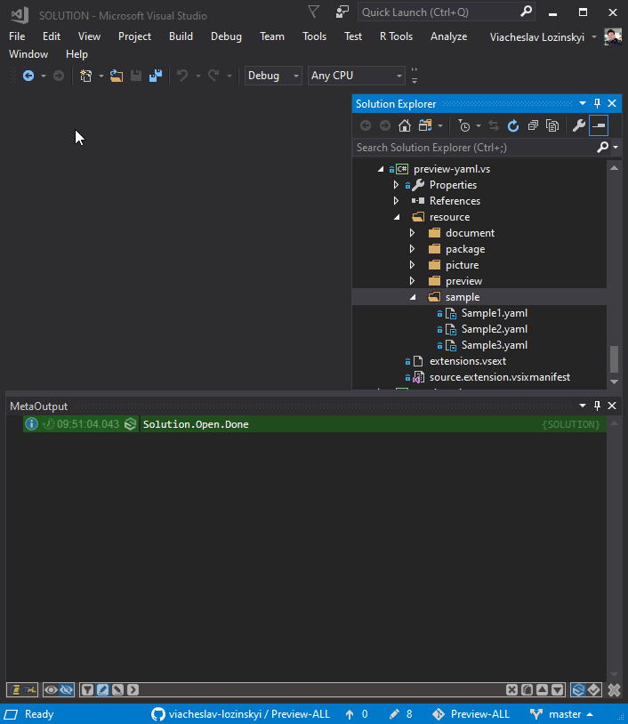

### Now you can look inside [YAML](https://en.wikipedia.org/wiki/YAML) file not opening it.
---

---
Download the extension from the [Visual Studio Marketplace](https://marketplace.visualstudio.com/items?itemName=ViacheslavLozinskyi.Preview-YAML)

---
Data visualization is based on [MetaProject](https://marketplace.visualstudio.com/items?itemName=ViacheslavLozinskyi.MetaProject)

Data extraction is based on [YamlDotNet](https://github.com/aaubry/YamlDotNet)